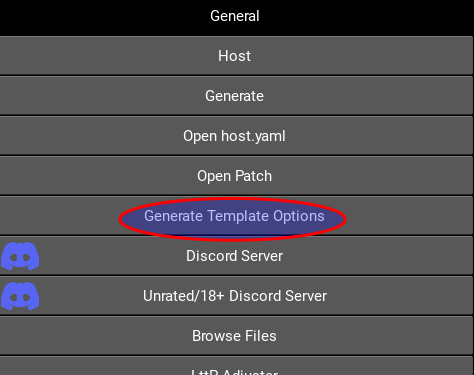

# Aquaria Randomizer execution for Linux

## Contents:
* [Generating a local randomizer json file](#generating-a-local-randomizer-json-file)
* [Generating an archipelago multiworld randomizer game](#generating-an-archipelago-multiworld-randomizer-game)
* [Using the launcher](#launcher)
* [Launching the local randomizer by command line](#local-randomizer-via-command-line)
* [Connecting an archipelago multiworld server by command line](#connecting-an-archipelago-multiworld-server-by-command-line)

## Generating a local randomizer json file

You can generate a local randomizer json file by going at the address https://aquariarandomizer.tioui.com

## Generating an archipelago multiworld randomizer game

Since the Aquaria game is not an official game for Archipelago (yet), you will have to generate the game locally. Here is the simplest way to do it.

* Download the Archipelago Release here: https://github.com/ArchipelagoMW/Archipelago/releases ;
* Extract the release;
* Download the `aquaria.apworld` from the Aquaria randomizer [release page](https://github.com/tioui/Aquaria_Randomizer/releases)
* Put the `aquaria.apworld` file in the `lib/world` directory of Archipelago;
* Then, launch `ArchipelagoLauncher`;
* In archipelago launcher, select "Generate Template Options".

* This will create the directory `Players/Templates` in the Archipelago root directory.
* Copy the `Aquaria.yaml` template file in the `Players` directory (one directory back from where you found the `Aquaria.yaml` file);
* Open the `Aquaria.yaml` in a text editor and adjust the options that you want (if you are not sure, you can just change your name);
* Don't forget to save the file when you are done;
* Note: If you want other players in the game, you will need to put their yaml files in the `Players` directory;
* then, use the Archipelago launcher to generate a game.

* When the game is generated, you should have a zip file in the `output` directory with the name `AP_<seed>.zip` (where `<seed>` is a long numerical value);
* Finally, you can host the server directly in the local PC by using "Host" in the `ArchipelagoLauncher` or host the game on the official server by uploading the `AP_<seed>.zip` on the Archipelago web page: https://archipelago.gg/uploads.

## Launcher

Please note that if you just double-click on the `Aquaria_Randomizer` file, you should see a launcher. The launcher let you select a JSON file for a local offline randomizer or server information for an Archipelago multiworld game.

## Local randomizer via command line

If you want to launch the randomizer using the command line, you will need a command line interpreter (sometime called terminal). You will have to go into the directory of the randomizer with `cd /home/user/Aquaria_Randomizer/` or some thing like that. Some file explorer have an option to open a directory in a terminal.

Here is the command line to use to start the local randomizer (with a randomized json file):

```bash
./aquaria_randomizer aquaria_randomized.json
```
Note: If you have a permission denied error when using the command line, you can use this command line to be
sure that your executable has executable permission:

```bash
chmod +x aquaria_randomizer
```

## Connecting an archipelago multiworld server by command line

If you want to launch the randomizer using the command line, you will need a command line interpreter (sometime called terminal). You will have to go into the directory of the randomizer with `cd /home/user/Aquaria_Randomizer/` or some thing like that. Some file explorer have an option to open a directory in a terminal.

Here is the command line to use to start the multiworld randomizer (with an Archipelago server):

```bash
./aquaria_randomizer --name YourName --server theServer:thePort
```

or, if the room has a password:

```bash
./aquaria_randomizer  --name YourName --server theServer:thePort --password thePassword
```

Note that if you only want to have server item message pertinent to you, you can use the `--message self` argument at the end of the command line. Like this without a password:

```bash
./aquaria_randomizer --name YourName --server theServer:thePort --message self
```

or with a password:
```bash
./aquaria_randomizer --name YourName --server theServer:thePort --password thePassword --message self
```

Note: If you have a permission denied error when using the command line, you can use this command line to be
sure that your executable has executable permission:

```bash
chmod +x aquaria_randomizer
```

