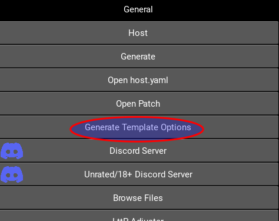
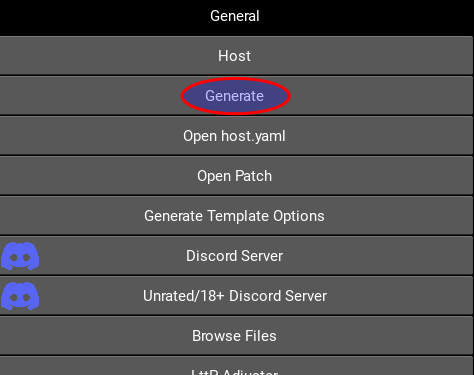
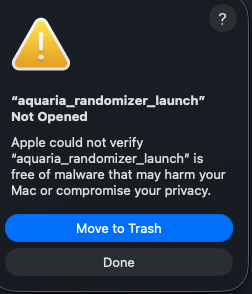
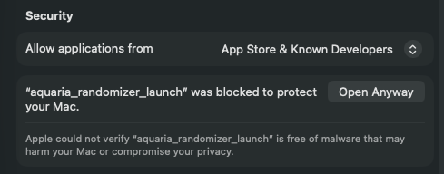
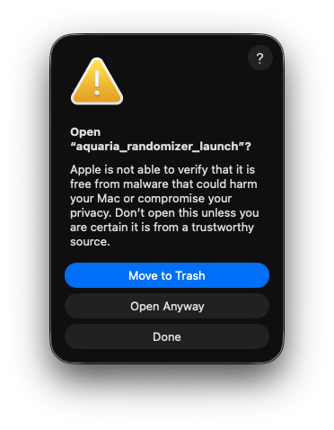
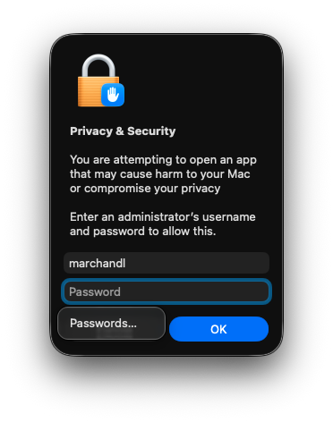

# Aquaria Randomizer execution for macOS

## Contents:
* [Generating a local randomizer json file](#generating-a-local-randomizer-json-file)
* [Generating an archipelago multiworld randomizer game](#generating-an-archipelago-multiworld-randomizer-game)
* [Starting the randomizer](#starting-the-randomizer)
* [Using the launcher](#launcher)
* [Launching the local randomizer by command line](#local-randomizer-via-command-line)
* [Connecting an archipelago multiworld server by command line](#connecting-an-archipelago-multiworld-server-by-command-line)
* [Error that can occur](#error-that-can-occur)

## Generating a local randomizer json file

You can generate a local randomizer json file by going at the address https://aquariarandomizer.tioui.com

## Generating an archipelago multiworld randomizer game

Since the Aquaria game is an official game for Archipelago, you can generate the game at this address: https://archipelago.gg/games/Aquaria/player-options

To generate a Multiworld Archipelago locally, here is the simplest way to do it:

* Download the Archipelago Release here: https://github.com/ArchipelagoMW/Archipelago/releases ;
* Extract the release;
* Launch `ArchipelagoLauncher`;
* In archipelago launcher, select "Generate Template Options".

* This will create the directory `Players/Templates` in the Archipelago root directory.
* Copy the `Aquaria.yaml` template file in the `Players` directory (one directory back from where you found the `Aquaria.yaml` file);
* Open the `Aquaria.yaml` in a text editor and adjust the options that you want (if you are not sure, you can just change your name);
* Don't forget to save the file when you are done;
* Note: If you want other players in the game, you will need to put their yaml files in the `Players` directory;
* then, use the Archipelago launcher to generate a game.

* When the game is generated, you should have a zip file in the `output` directory with the name `AP_<seed>.zip` (where `<seed>` is a long numerical value);
* Finally, you can host the server directly in the local PC by using "Host" in the `ArchipelagoLauncher` or host the game on the official server by uploading the `AP_<seed>.zip` on the Archipelago web page: https://archipelago.gg/uploads.

## Starting the randomizer

## Launcher

Because of the way macOS (or finder) starts executable file, if you simply double-click on the `aquaria_randomizer` file,
the game will not work. This is because the game cannot see the resources of the Aquaria folder because it does not
search on the correct folder (it searches the resources on the user home folder).
So, a script named `aquaria_randomizer_launch` can be used to launch the game correctly.

If you double-click on this script, a launcher should start. The launcher let you select a JSON file for a local offline randomizer or server information for an Archipelago multiworld game. If you get an error saying that Apple cannot verify the program,
check this section: [Error that can occur](#error-that-can-occur)

## Local randomizer via command line

If you want to launch the randomizer using the command line, you will need a command line interpreter (sometimes called terminal). You will have to go into the directory of the randomizer with `cd /Users/user/Aquaria_Randomizer/` or something like that.
You can open a terminal from Finder by right-clicking (or command+click) on a folder and selecting "New terminal at folder".

Here is the command line to use to start the local randomizer (with a randomized json file):

```bash
./aquaria_randomizer aquaria_randomized.json
```
Note: If you have a permission denied error when using the command line, you can use this command line to be
sure that your executable has executable permission:

```bash
chmod +x aquaria_randomizer
```

## Connecting an archipelago multiworld server by command line

If you want to launch the randomizer using the command line, you will need a command line interpreter (sometimes called terminal).
You will have to go into the directory of the randomizer with `cd /Users/user/Aquaria_Randomizer/` or something like that.
You can open a terminal from Finder by right-clicking (or command+click) on a folder and selecting "New terminal at folder".

Here is the command line to use to start the multiworld randomizer (with an Archipelago server):

```bash
./aquaria_randomizer --name YourName --server theServer:thePort
```

or, if the room has a password:

```bash
./aquaria_randomizer  --name YourName --server theServer:thePort --password thePassword
```

Note that if you only want to have a server item message pertinent to you, you can use the `--message self` argument at the end of the command line. Like this without a password:

```bash
./aquaria_randomizer --name YourName --server theServer:thePort --message self
```

or with a password:
```bash
./aquaria_randomizer --name YourName --server theServer:thePort --password thePassword --message self
```

Also, you can activate Archipelago death link by adding `--deathlink` in the command line. Like this:
```bash
./aquaria_randomizer --name YourName --server theServer:thePort --deathlink
```

Note: If you have a permission denied error when using the command line, you can use this command line to be
sure that your executable has executable permission:

```bash
chmod +x aquaria_randomizer
```

## Error that can occur

### WxWidgets library not installed
 
If you have an error saying `Library not loaded:` followed by a path that contains `wxwidgets` in it, it is probably because you did not install the wxwidgets library. Please refer to the installation instruction here: [install_macos.md](install_macos.md)

### Randomizer not opened popup

If you have an error dialog saying that Apple cannot verify the executable (and giving you the choice to "Move to trash" or do nothing);



Click the "Done" button, then:

- Go to "System Settings -> Privacy & Security" ("System Settings" can be accessed using the apple in the top left of the screen);
- Close to the bottom of the "Privacy & Security" window, you should see a section saying that the randomizer was blocked to protect your mac with an "Open anyway" button:



- Click the "Open anyway" button; it should give you a similar error window as before, but with a button "Open anyway":



- Click (again) the "Open anyway" button; the system will ask you to enter your administration user’s password:



- Then, the randomizer should start (note that it is possible that you should follow those step twice, once for the `aquaria_randomizer_lauch` and another for the `aquaria_randomizer`).
