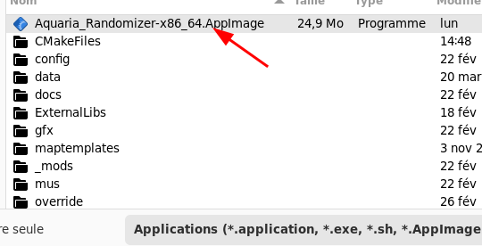

# Execution of the Aquaria Randomizer Using the Steam Client

You can set up the Steam client to easily launch a randomizer game. Here is the procedure to do so:

1. First, install the Randomizer using the procedure for your operating system:
	* For Windows: [install_windows.md](install_windows.md)
	* For Linux with AppImage: [install_appimage.md](install_appimage.md)
	* For Linux sit the tar file: [install_linux.md](install_linux.md)
2. Then, you must add the `Aquaria_Randomizer` executable (`Aquaria_Randomizer.exe` on Windows, `Aquaria_Randomizer-*.AppImage` for the Linux AppImage and `Aquaria_Randomizer` for Linux tar file) in the Steam Client:
	* In the Steam client menu, select `Games` and then `Add a Non-Steam game in My Library...`

	* In the `Add Non-Steam game` window, select the `Browse` button

	* In the dialog box, select the `Aquaria_Randomizer` executable  (`Aquaria_Randomizer.exe` on Windows, `Aquaria_Randomizer-*.AppImage` for the Linux AppImage and `Aquaria_Randomizer` for Linux tar file)

	* Then, click on the `Add selected program` in the `Add Non-Steam game` window:

	* The Randomizer is now in the Steam client Library. If you execute it, you should see the randomizer launcher.
3. Now, you can directly give the randomizer parameters by using the Shortcut properties window:

	
	* For a local randomizer that is using a json file, you can indicate the emplacement of the json file in the `Launch option`:

	* For a MultiWorld Archipelago randomizer, you can indicate the server address and port, the player name and the password if necessary in the `Launch option`:

		* Note that you can have more information about command-line options in the [execution_windows.md](execution_windows.md) or [execution_appimage.md](execution_appimage.md) or [execution_linux.md](execution_linux.md).
	* Also note that you can change the game name and give it an icon with this window.
4. Then, you can directly start the randomizer by using the `Start` button in the Aquaria_Randomizer game in the library:

