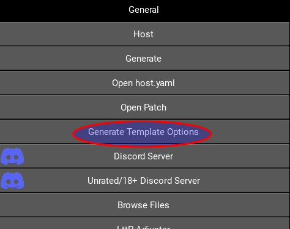
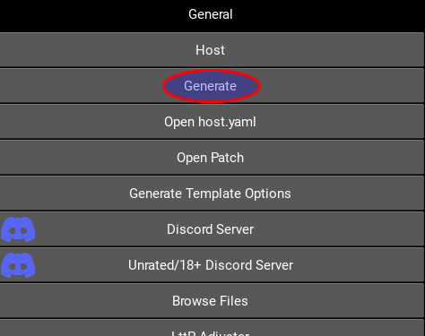

# Aquaria Randomizer execution for Windows

## Contents:
* [Generating a local randomizer json file](#generating-a-local-randomizer-json-file)
* [Generating an archipelago multiworld randomizer game](#generating-an-archipelago-multiworld-randomizer-game)
* [Using the launcher](#launcher)
* [Launching the local randomizer by command line](#local-randomizer-via-command-line)
* [Connecting an archipelago multiworld server by command line](#connecting-an-archipelago-multiworld-server-by-command-line)

## Generating a local randomizer json file

You can generate a local randomizer json file by going at the address https://aquariarandomizer.tioui.com

## Generating an archipelago multiworld randomizer game

Since the Aquaria game is an official game for Archipelago, you can generate the game at this address: https://archipelago.gg/games/Aquaria/player-options

Please note that the "Death Link" option of the Archipelago site is not working. This option will be removed from the
option in the future. Now, the way to activate death link is via the game launcher of the command line (see below).

To generate a Multiworld Archipelago locally, here is the simplest way to do it:

* Download the Archipelago Release here: https://github.com/ArchipelagoMW/Archipelago/releases ;
* Extract the release;
* Download the `aquaria.apworld` from the Aquaria randomizer [release page](https://github.com/tioui/Aquaria_Randomizer/releases)
* Put the `aquaria.apworld` file in the `lib/world` directory of Archipelago;
* Then, launch `ArchipelagoLauncher.exe`;
* In archipelago launcher, select "Generate Template Options".

* This will create the directory `Players/Templates` in the Archipelago root directory.
* Copy the `Aquaria.yaml` template file in the `Players` directory (one directory back from where you found the `Aquaria.yaml` file);
* Open the `Aquaria.yaml` in a text editor and adjust the options that you want (if you are not sure, you can just change your name);
* Don't forget to save the file when you are done;
* Note: If you want other players in the game, you will need to put their yaml files in the `Players` directory;
* then, use the Archipelago launcher to generate a game.

* When the game is generated, you should have a zip file in the `output` directory with the name `AP_<seed>.zip` (where `<seed>` is a long numerical value);
* Finally, you can host the server directly in the local PC by using "Host" in the `ArchipelagoLauncher` or host the game on the official server by uploading the `AP_<seed>.zip` on the Archipelago web page: https://archipelago.gg/uploads.

## Launcher

Please note that if you just double-click on the `Aquaria_Randomizer.exe` file, you should see a launcher. The launcher let you select a JSON file for a local offline randomizer or server information for an Archipelago multiworld game.

If Windows block the execution of the randomizer because it is unknown, it is normal. You did not download a virus or anything. You can just accept the execution. The executable is just not sign by Microsoft.

## Local randomizer via command line

If you want to launch the randomizer using the command line, you will need a command line interpreter (cmd, powershell, etc.) You can open the command line interface by writing `cmd` in the address bar of the Windows file explorer.

Here is the command line to use to start the local randomizer (with a randomized json file):

```bash
aquaria_randomizer.exe aquaria_randomized.json
```

## Connecting an archipelago multiworld server by command line

If you want to launch the randomizer using the command line, you will need a command line interpreter (cmd, powershell, etc.) You can open the command line interface by writing `cmd` in the address bar of the Windows file explorer.

Here is the command line to use to start the multiworld randomizer (with an Archipelago server):

```bash
aquaria_randomizer.exe --name YourName --server theServer:thePort
```

or, if the room has a password:

```bash
aquaria_randomizer.exe  --name YourName --server theServer:thePort --password thePassword
```

Note that if you only want to have server item message pertinent to you, you can use the `--message self` argument at the end of the command line. Like this without a password:

```bash
aquaria_randomizer.exe --name YourName --server theServer:thePort --message self
```

or with a password:
```bash
aquaria_randomizer.exe  --name YourName --server theServer:thePort --password thePassword --message self
```

Also, you can activate Archipelago death link by adding `--deathlink` in the command line. Like this:
```bash
aquaria_randomizer.exe --name YourName --server theServer:thePort --deathlink
```