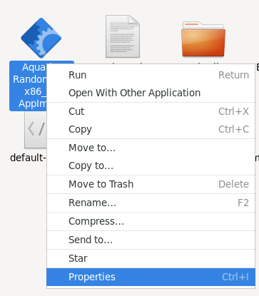
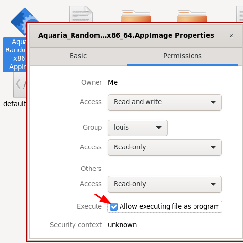

# Aquaria randomizer Linux AppImage installation

To play the Aquaria randomizer, you need to own a copy of the original Aquaria game. The game can be bought in almost every online game sellers (GOG, Steam, etc.)

To install the randomizer unsing AppImage, put the released AppImage from the release page and put it in the original Aquaria game directory.

Then, you should make the AppImage file executable. You can do this by using a file explorer:

 

 or using the following command line

```bash
chmod +x Aquaria_Randomizer-*.AppImage
```

Once the randomizer is installed you can launch it. For details about the execution options, see: [execution_appimage.md](execution_appimage.md)
